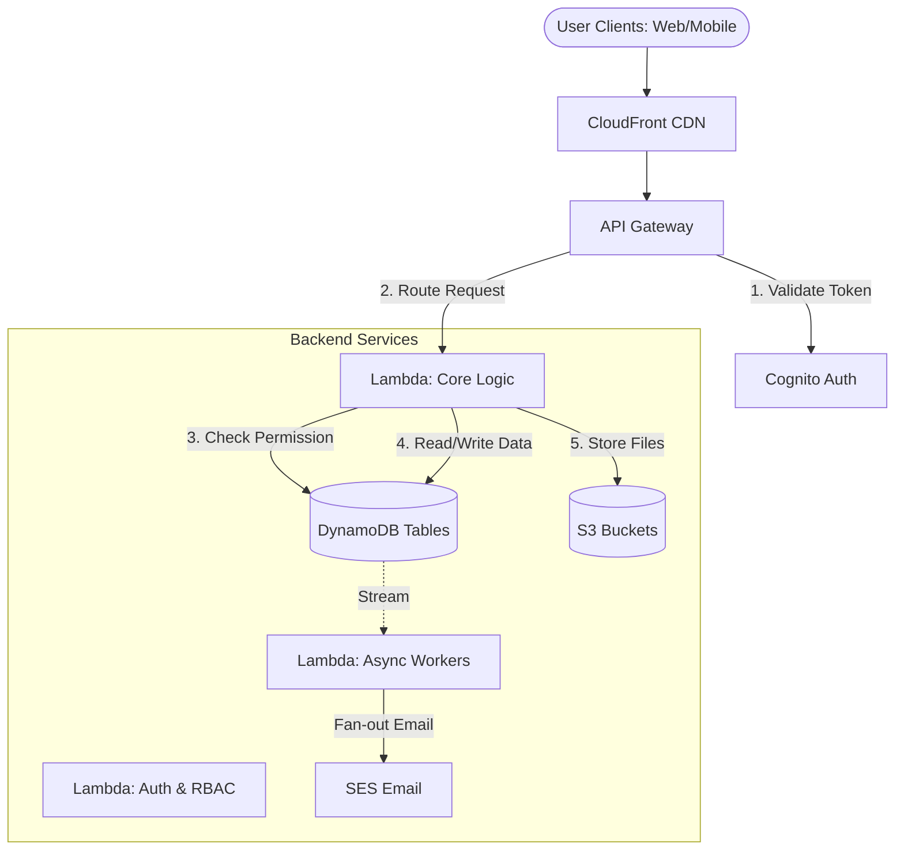

# Data Flow & Interaction Diagrams
**EventGo Architecture**

## 1. System High-Level Data Flow

---

## 2. Critical Workflows

### A. Registration Flow (Atomic Transaction)
1.  **Frontend**: User clicks "Register" on Event Detail Page.
    *   *Payload*: `{ eventId, userId }`
2.  **API Gateway**: Forwards request to `registerUser` Lambda.
3.  **Lambda (Sync)**:
    *   **Check 1**: Valid User? (From `USERS` table cache/lookup)
    *   **Check 2**: Event Open? (From `EVENTS` table, `status="PUBLISHED"`)
    *   **Check 3**: Seats Available? (`max_participants` check)
    *   **Check 4**: Not already registered? (`ConditionExpression` on `REGISTRATIONS` table)
4.  **DynamoDB**: `PutItem` to `REGISTRATIONS` table.
    *   *If Waitlist*: Update `EVENTS.waitlist_count`.
5.  **Lambda**: Returns `201 Created` or `409 Conflict` (Waitlist/Full).
6.  **Async Process**:
    *   DynamoDB Stream triggers `notificationWorker`.
    *   `notificationWorker` sends confirmation email via SES.

### B. Team Formation (Consistency)
1.  **Frontend**: "Create Team" -> Enter Name -> Invite Members (Emails).
2.  **Lambda**:
    *   Creates Team Item in `TEAMS`.
    *   Adds Creator as Leader in `TEAM-MEMBERS`.
    *   Generates `invite_code` (signed token).
3.  **Frontend**: Leader shares link.
4.  **Invitee Click**: "Join Team" with code.
5.  **Lambda**:
    *   Verifies signature.
    *   Validates Team Size < Max.
    *   `TransactWriteItems`:
        *   Add Member to `TEAM-MEMBERS`.
        *   Increment `member_count` in `TEAMS`.

### C. Submission & Scoring (Idempotency)
1.  **Student**: Uploads PDF/ZIP to S3 (Pre-signed URL).
2.  **Student**: Submits Metadata (`title`, `s3_key`) to API.
3.  **DynamoDB**: Stores metadata in `SUBMISSIONS`. Status=`PENDING_REVIEW`.
4.  **Judge**: Views Submission -> Enters Scores (0-10) per criterion.
5.  **Lambda**:
    *   Calculates Total Score.
    *   `PutItem` to `JUDGING-SCORES` (PK=SubId, SK=JudgeId).
    *   *Prevents double scoring*: `attribute_not_exists(score)`.

---

## 3. Frontend-Backend Interaction Rules

1.  **Optimistic UI**:
    *   Frontend *assumes success* for simple likes/bookmarks.
    *   Frontend *waits for success* for payments/registrations.
    *   **Rollback**: If API fails, revert local state and show toast error.

2.  **Pagination Strategy**:
    *   All Lists (`GET /events`, `GET /users`) use `Limit` + `LastEvaluatedKey`.
    *   Frontend must handle `nextToken` in response loop.

3.  **Error Handling**:
    *   400: Bad Request (Validation).
    *   401/403: Auth/RBAC Failure -> Redirect Login/Show Permission Denied.
    *   404: Not Found (Soft deleted items returned as 404).
    *   5xx: Internal Error -> Retry with exponential backoff (Client-side).
